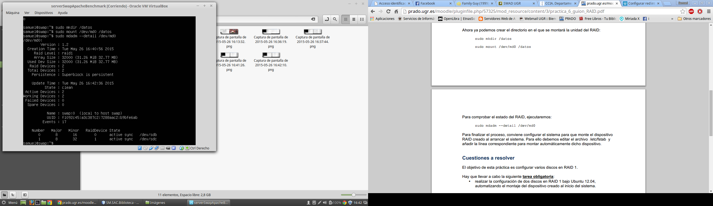
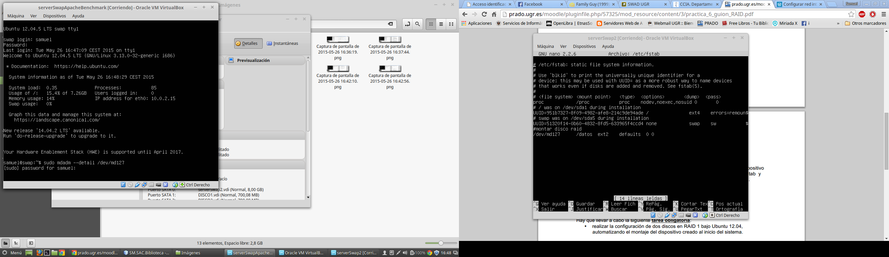

#**Practica 6. Discos en RAID**

##**Configuración del RAID por sofware**

>>     sudo apt-get install mdadm

>>     sudo fdisk -l 

>>     sudo mdadm -C /dev/md0 --level=raid1 --raid devices=2 /dev/sdb /dev/sdc

>>     sudo mkfs /dev/md127

Ahora ya podemos crear el directorio en el que se montará la unidad del RAID:
>>        sudo mkdir /datos
>>        sudo mount /dev/md0 /datos

Para comprobar el estado del RAID, ejecutaremos:

>>     sudo mdadm --detail /dev/md0

Editamos el archivo /etc/fstab y para montar automáticamente dicho dispositivo:

>>     sudo nano /etc/fstab

>     Añadimos la siguiente linea:

>>      /dev/md127    /datos    ext2    defaults 0  0  

